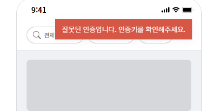
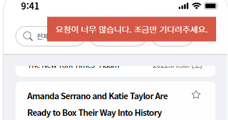

# New York Time Api Test

## 1. 프로젝트 소개

New York Time Api를 이용하여 기사를 검색 스크랩할 수 있는 사이트입니다.

## 2. 기술 스택

- `TypeScript` : 정적 타입을 도입하여 코드 안전성 및 유지보수를 쉽게 하기위해 사용
- `Redux/tookit` : 리덕스 보일러플레이트를 줄이고, 전역상태 관리하기 위해 사용
- `Redux-persist` : 리덕스 스토어 데이터를 로컬, 세션 스토리지에 저장하기 위해 사용
- `Axios` : New York Time Api를 통해 데이터 받아오기 위해 사용
- `Styled-components` : css-in-js을 통해 컴포넌트 스타일을 관리하기 위해 사용
- `Mui-x-date-pickers` : 달력의 날짜를 선택할 수 있는 컴포넌트 사용하기 위해 사용
- `Monent` : 자바스크립트 Date를 쉽게 조작할 수 있도록 사용

## 3. 프로젝트 구조

```ts
│
├── public                 // Favicon 등 Static Resource 저장
├── src
│   ├── api                // REST API 사용을 위한 HTTP 서비스, Axios Error Handle
│   ├── assets             // 이미지 및 글로벌 Style, theme
│   └── components         // common을 이용하여 만든 컴포넌트 모음 및 비지니스 로직
│       └── common         // 재사용 할 수 있는 UI 컴포넌트 모음
│   ├── hooks              // Custom Hooks
│   ├── modules            // redux/toolkit Slice 모음
│   ├── pages              // 라우터 경로에 따른 나타나는 페이지 컴포넌트 모음
│   ├── App.tsx
│   └── index.tsx
├── .env                   // 뉴욕타임즈 API Key
├── README.md
├── package.json           // 의존성 설정 파일
```

> ⚙ 프로젝트 실행 해보기

```ts
npm install
npm start
브라우저 localhost:3000 접속
```

## 4. 페이지 동작 소개

### 공통(home, scrap)

1. 무한 스크롤로 동작합니다.
2. 스크랩 아이콘을 누르면 팝업으로 알려줍니다. 스크랩 아이콘을 여러개를 누르면 맨 처음에 했던 행동만 팝업을 알려줍니다.

> ex ) 스크랩 삭제,스크랩 추가, 스크랩 추가, 스크랩 삭제라는 행동을 했을 때 처음 스크랩 삭제만 팝업으로 알려줍니다.

2. 새로고침을 하여도 기존에 가져왔던 데이터 및 스크롤 위치가 유지됩니다.
3. 뉴욕타임즈 기사로 리다이렉트 됬다가 돌아와도 데이터 및 스크롤 위치가 유지됩니다.
4. 뉴욕타임즈 API status code 401, 429 일때 팝업으로 메세지를 뛰어줍니다.
<div align=center>
    
   
</div>

### Top 컴포넌트(필터링)

1. home페이지, Scrap 페이지는 서로 필터링을 공유하지 않고 개별적으로 동작합니다.
2. 복수의 필터링이 없으 시 날짜의 내림 차순으로 기사를 가져옵니다.
3. 헤드라인 검색 시 특수문자, html 입력은 불가합니다. 최대 100자로 제한합니다.
4. 헤드라인 검색은 대소문자를 구별하지 않습니다.
5. 날짜를 선택 시 해당 날짜로 기사를 가져옵니다. 해당 날짜 기준으로 날짜를 내림 차순으로 기사를 가져옵니다.
6. 국가와 날짜를 선택 시 해당 날짜부터 날짜의 오름 차순으로 기사를 가져옵니다.
7. 국가는 복수 선택을 하여 검색할 수 있습니다. 대한민국을 선택 북한 미선택, 혹은 반대상태 일때는 korea라는 키워드가 겹쳐서 미선택 국가를 가져오는 걸 방지하고, 미선택 된 국가는 가져오지 않습니다.
8. 새로고침을 및 뉴욕타임즈 기사로 리다이렉트 됬다가 돌아와도 필터링은 유지됩니다.
9. 브라우저를 종료시 필터링은 초기화 됩니다.
10. 선택된 날짜는 오늘 날짜보다 큰 날짜를 선택 시 초기화가 됩니다.

### Footer 컴포넌트(라우터)

1. 페이지는 전환 시 스크롤 위치는 top으로 초기화됩니다.

### Home페이지

1. 필터링이 없으면 오늘 날짜 기준 내림 차순으로 기사를 가져옵니다.
2. 브라우저를 종료시 기사 데이터 유지가 초기화 됩니다.

### Scrap페이지

1. 필터링이 없으면 날짜의 내림 차순으로 스크랩된 기사를 보여줍니다.
2. 브라우저를 종료하여도 스크랩된 기사 데이터는 유지가 됩니다.
